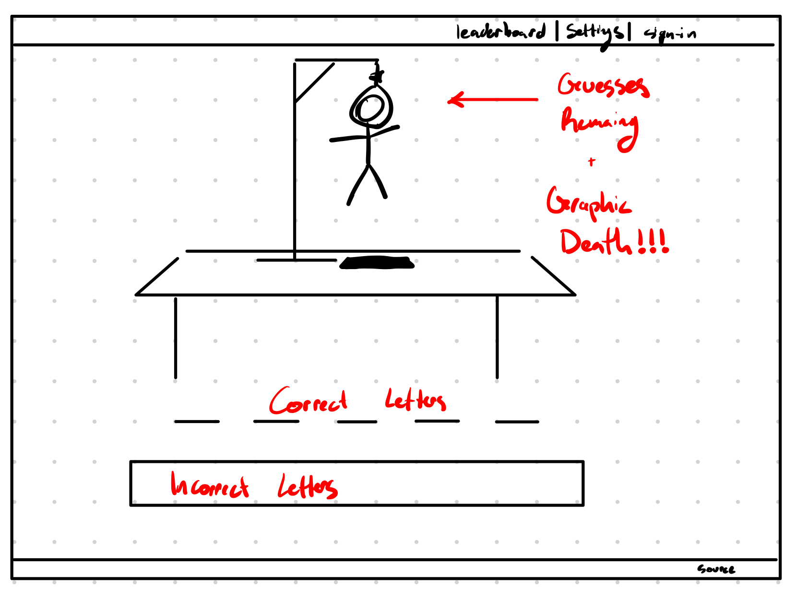
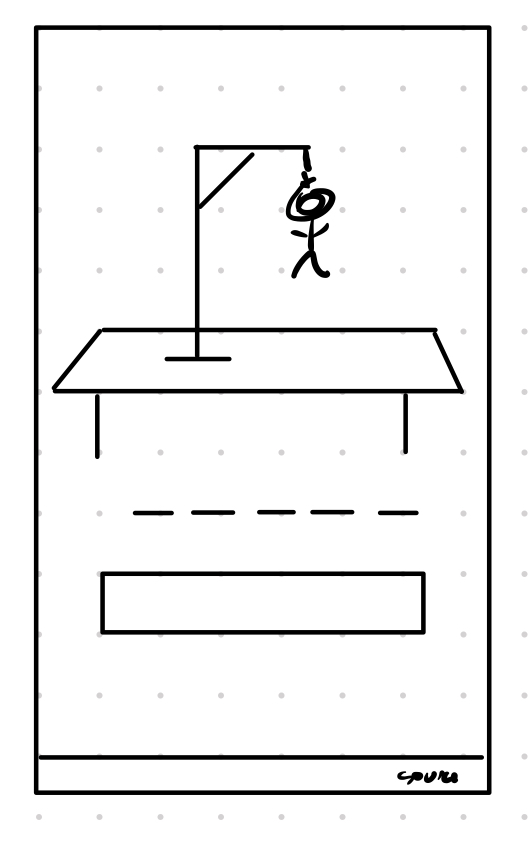

# Mnemonic Hangman

## Description deliverable

### Elevator pitch

Need a new crypto wallet? Want to have fun guessing random BIP-39 passphrases? You shouldn't do either, yet here we are! Enjoy trying to figure out a random (real) crypto wallet passphrase, who knows, maybe you could get rich quick!

### Design

Here's what I thought it'd look like a while ago:

Here is what the mobile version will look like

### Key features

* Secure login over HTTPS
* Ability to make letter guesses and see
* Game state persists, allowing you to pause whenever you need

### Technologies

I'm going to use the required technologies in the following ways:

* **HTML** - Uses correct HTML structure for application. Three HTML pages. One for playing the game, one for logging in, one for seeing the leaderboard, and one for user settings.
* **CSS** - Application styling that looks good on different screen sizes, uses good whitespace, color choice, and contrast.
* **JavaScript** - Provides login, correct/incorrect letter display, submitting choices, displaying leaderboard information, backend endpoint calls.
* **Service** - Backend service with endpoints for:
  * login & create account
  * retrieving leaderboard information
  * retrieving user settings
  * retrieving current game state

* **DB** - Store users, highscores, current game state, historical game outcomes, and settings in database.
* **Login** - Register and login users. Credentials securely stored in database. Game state, game results, and settings aren't saved unless authenticated. Authentication also allows you to participate in the leaderboard.
* **WebSocket** - As each user completes their game, their results will automatically appear on other users leaderboards.
* **React** - Application ported to use the React web framework

## HTML Deliverables

For this deliverable I built out the structure of my application using HTML.

* **HTML pages** - Three HTML page that represent the ability to play, login, and see the leaderboard.
* **Links** - The three pages contain links to each other.
* **Text** - Text representing the current game state and leaderboard info are included.
* **Images** - I included an image of a hanging.
* **Login** - Input boxs and submit button for login.
* **Database** - The leaderboard information represents information pulled from the database.
* **WebSocket** - The count of deaths, saves, and all time records represent realtime data.

## CSS Deliverables

For this deliverable I properly styled the application into its final appearance.

* **Header, footer, and main content body**
* **Navigation elements** - Changed the background, updated the link colors, and removed the underlines.
* **Responsive to window resizing** - Navigation links are collapsed behind a button when the screen gets small and `main` content is centered and aligned within `display: flex;`.
* **Application elements** - Made good use of whitespace and made sure elements were easily read and distinguishable.
* **Application text content** - Used consistant fonts that contrast from surrounding elements.
* **Application images** - Sized image to changed based on view width.

## JavaScript Deliverables

For this deliverable I implemented the base javascript code for the project.

* **Login Support** - Added functionality to the login page and updates the username across the site.
* **Database+Websocket** - Right now win/loss info is kept in local storage, but will be a real database later (and updated in real time using websockets).
* **Hangman Gameplay** - Keep track of guessed letters, allow users to submit letters, etc.

## Service Deliverables

For this deliverable I converted my startup app to a service.

* **Node.js/Express HTTP service** - I didz it.
* **Static middleware for frontend** - ditto.
* **Calls to third party end points** - Just for funsies, dad jokes at the bottom of every page.
* **Backend service endpoints** - Game results can be saved/gotten from service endpoints
* **Frontend calls service endpoitns** - This is done when finishing a game and when checking out the leaderboard.

## DB Deliverable

* **MongoDB Atlass database created** - complete
* **Endpoints for data** - My endpoints now process the data and send it to mongo, which means...
* **Data is stored in MongoDB**